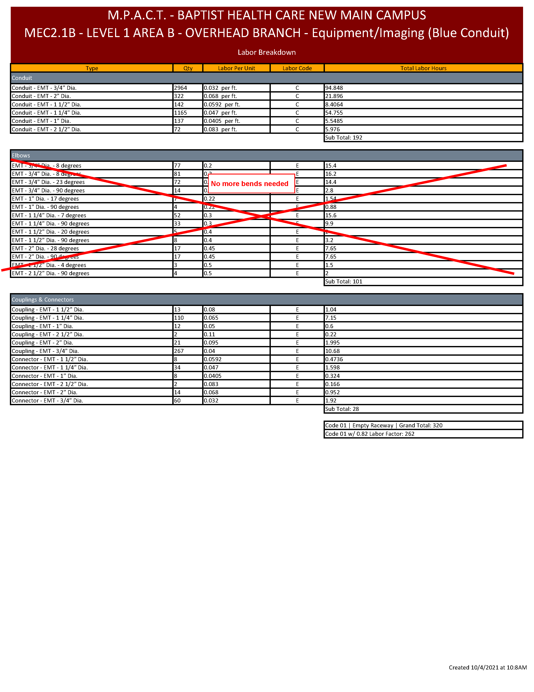
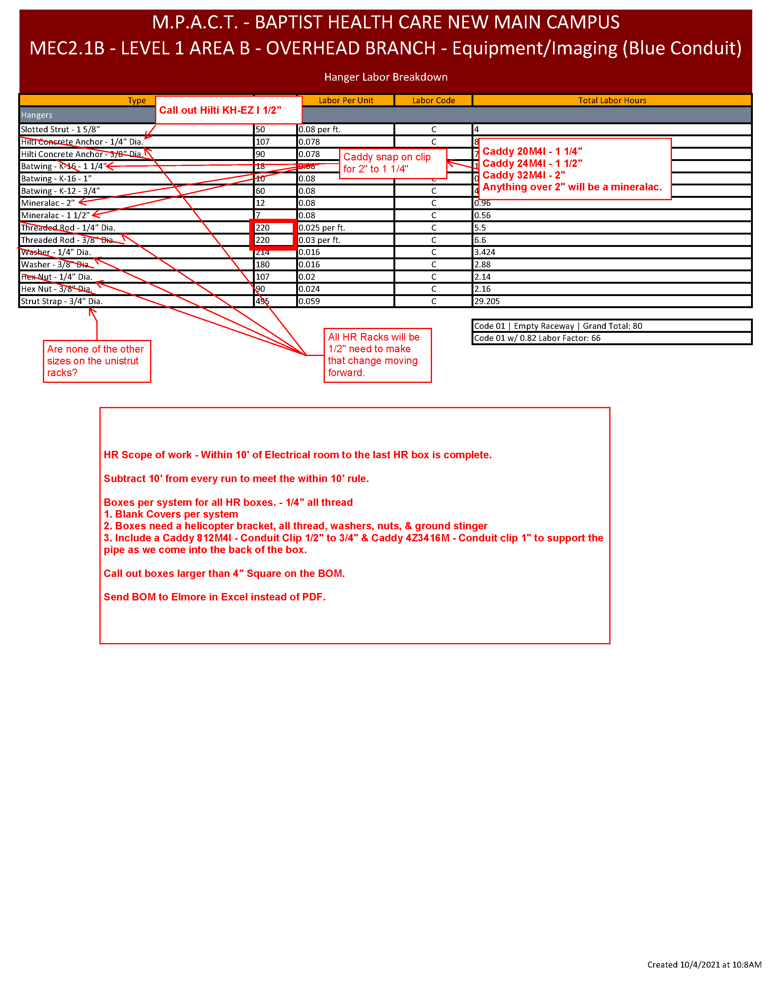

# Searchable Work Tags
- @TODO
- @DELETE
- @REFACTOR

  

# Todo
- check pull box sizes for accuracy
- make the program auto save the package every 3 mins
- make selecting a package from the drop down switch all the packages. Then add a bool in the settings to separate it, like it is now.
- make strut hanger generation not suck
- tokenize some string for newline in the BOM title like 'MEC2.1C - Level 1 Area C - Overhead Branch - '
- Fix 1/2" washers and hex nuts [0.016	C] and [0.02	C] respectively  not showing up
- Add [Caddy 4Z34812M Multi Function ] x1 for every helicopter bracket
- 2x square washers and 1x hex nut per threaded rod (really you should count anchors to get to this.)
- (12/2/21) Update labor tab GUI
- (12/2/21) Update Hardware tab GUI
- (12/2/21) Update Voltage Drop GUI
- (12/2/21) Update Wire Migration GUI
- (12/2/21) Update Wire Automation GUI
- (12/2/21) Update Wire GUI
- (12/2/21) Update Settings GUI
- (12/2/21) Fix Help Menu GUI

# Completed
- make program prompt to load or create new package on first load when no package path is set
- Show Elbows above 1 1/4" on distribution
- Don't show elbows on branch
- Fix accumulating strut straps between runs
- fix duplicate area folder craeted when exporting (i.e. excel/2B/2B and pdf/2B/2B 2B would be the area folder)
- fix new package not displaying the correct root export path
- Fixed Sub-Package Selection errors when loading package
- User needs to be able to set a location for the BOM Exports
- Making a sub package now creates it in all categories
- Remove 10' from all runs to account for elec rooms
- HR boxes should use 1/4" thread by default
- On Strut, default to 1/2" all thread
- Send only excel files out as the final product. prioritize this over the PDF's
- Make a system that recognizes pull boxes and adds them to the BOM automatically
- Add hardware to the HR boxes when the single hanger for the box is calculated
  - Blank Covers
  - Ground Stingers
  - Helicopter Brackets
  - 3x Hex Nuts
  - 3x Washers
- Mineralac hangers should only apply to single conduit above 2"
- Fix PDF BOM export name
- Fix Wire and Labor BOM's spitting out Wire Pull and Wire Total sheets even when there is no wire to export
- Fix Labor Hours file not loading on new project

## The pdf document that these chagnes came from (provided by elmor):
### OLD AS OF 10/18/2021

     
# table test
|||
|-----|------|
| asd | 1    |

